# GRAPHIC INTERFACE

## ENTRY PAGE

The entry page is made by the components:
- TopBar
- SideBar
- Header
- Box

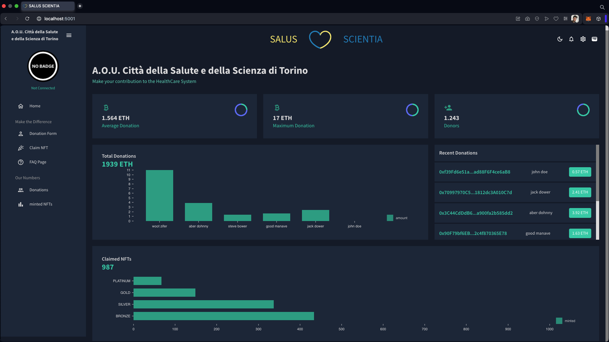

### TOPBAR

In the middle of the TopBar is located a motto with a logo in between the 2 word composing it.
On the right side several icons are located, the moon icon allows to switch from the bright mode to the dark mode.
Once the moon icon is licked it is switched with a sun icon and most of the colors of the site are switched to brighter ones.
     
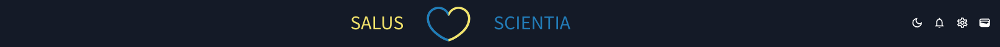

### HEADER

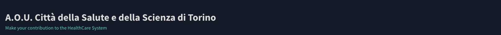

### PAGE CONTENT

The page content is made by a `<Box>`, with the property ```display="grid"```, with 3 rows, in each of those there are other Box with the property ```gridColumn="span 4"```.
The toatal number of columns per row is 12 as designed by MUI library.
In the first row are located 3 `<StatBox>` with few statistics on the Smart Contract.
In the second row, on the left-side there is the component `<DonationChart>`, displaying the latest donations in a bar chart, and a list of latest donations on the rigth-side.
On the third row is located the component `<MintedNFTsChart>`, diplsaying how many NFTs have been minted per type by the Smart Contract.
All the data showed in the page are made up and the interactions with Smart Contract on the BlockChain have to be implemented.

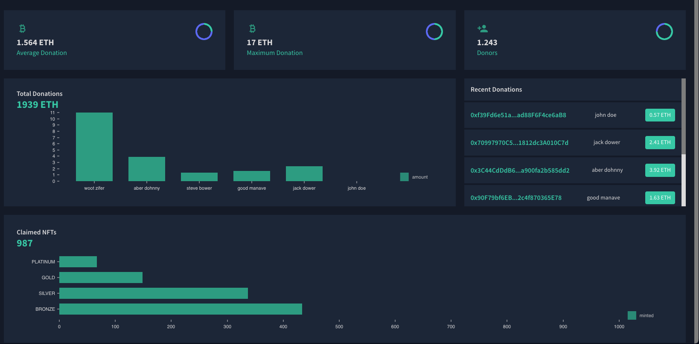

### SIDEBAR

On the left upper-side is located the denomination of company while on the right a toogle button allowing to collapse the SideBar.
Below if the user is not conected with any wallet or hasn't claimed any of the NFTs of the contract it is desplayed a round no badge picture.
If the user has claimed at least one NFTs of the available ones it is displayed a picture representing the better NFT among the claimed ones.
Below that is located either a text "not connected" if the user is not connected to the application with any wallet either the address of the connected wallet.
Lastly, there are the link to the other pages of the site.

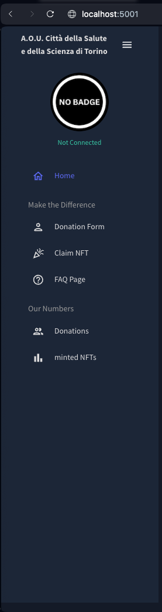

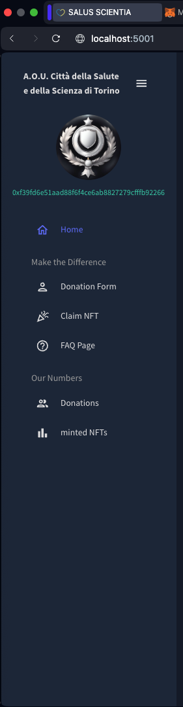

## DONATION FORM

On this page, the user can fill the form with th required data, among those the name, the surname and the amount which once the claim button is clicked will be fed into the donate function of the Smart Contract.
The other data for the time being won't be saved anywhere.
The donationForm scene is built using other than the Material UI for the graphic interface, the libraries `Formik` and `Yup` for the form schema and data validation.


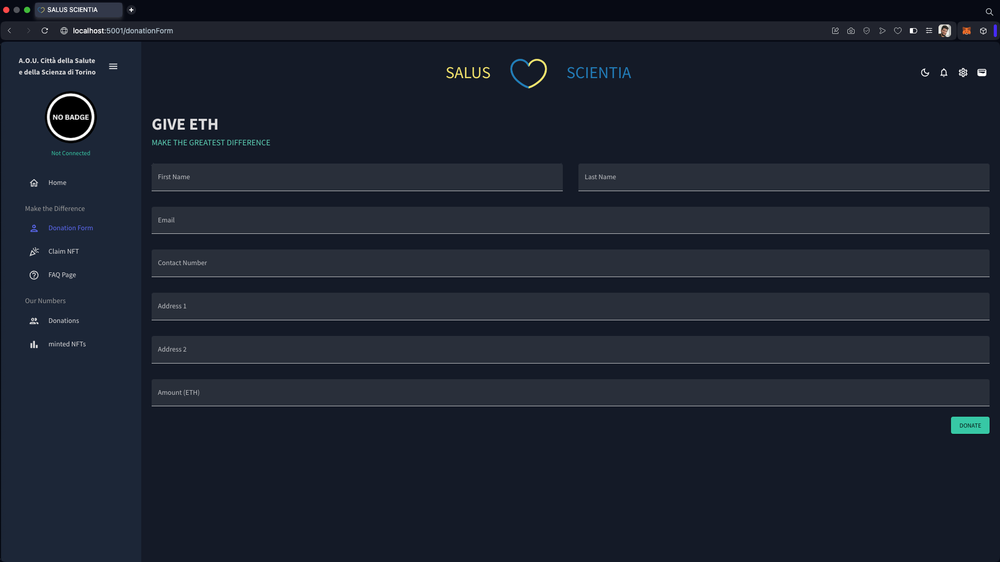

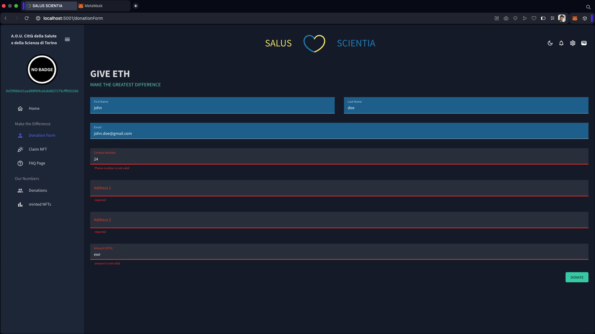

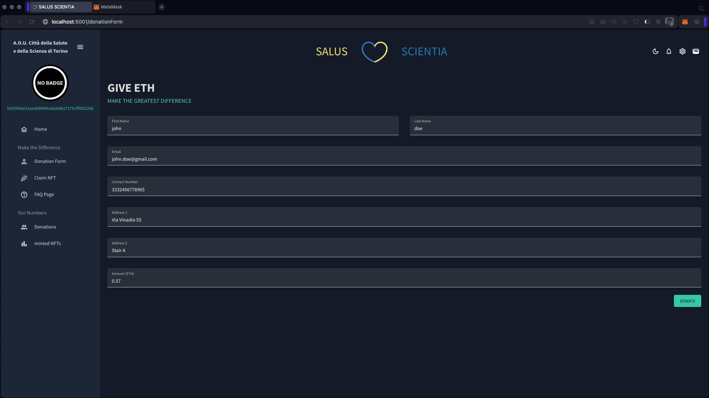

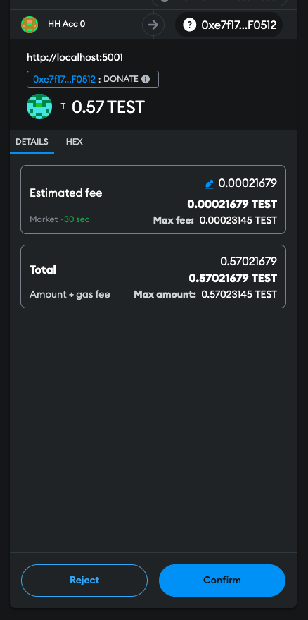

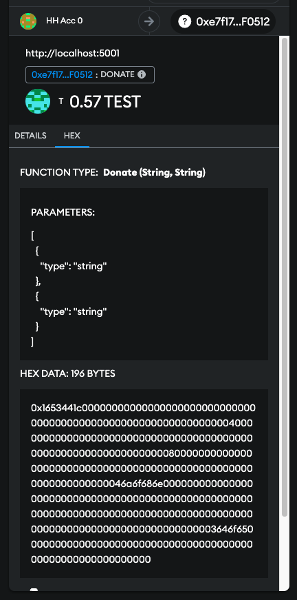
## CLAIM NFT

This page is displaying a brief text, a picture and eventually a button.
If the user is etiher not connected with any wallet either has not donated any amount or has already cliamed a NFT after the last donation it will be displayed the no badge of honour picture and no button at all other than a brief text saying the user is not allowed to claim any NFT.
If the user has connected a wallet with a address that matches the one allowed by the Smart Contract to claim a NFT, i.e. that EOA has called successfully at least one time the donate function of the smart contract and since the last call on previously said function has not made on claimNFT, so the latest unrewarded donations will be summed and if that sum is grater ro not of the threesholds enstabilished in the smart contract it will be displayed the picture corresponding to the type of reward the user is allowed for.
In the case mentioned above will be displayed as well a Claim Button that will trigger the claimNFT function of the smart contract.


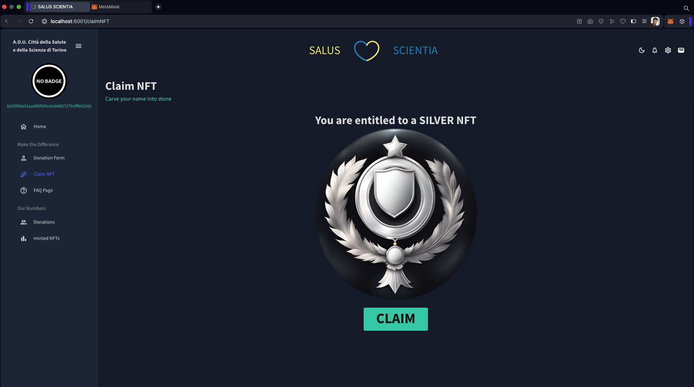

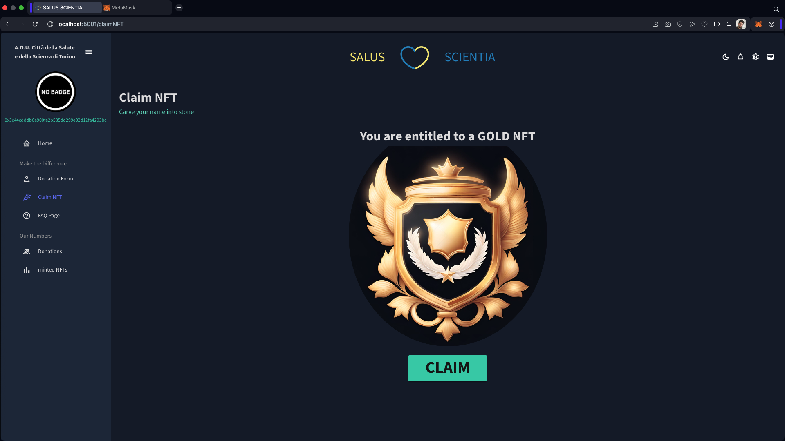

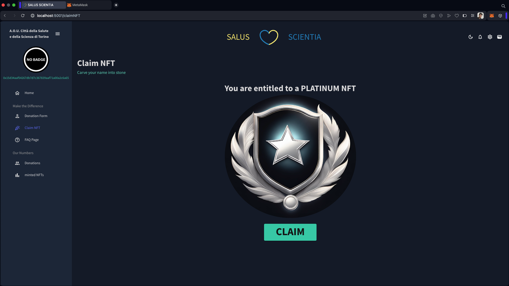

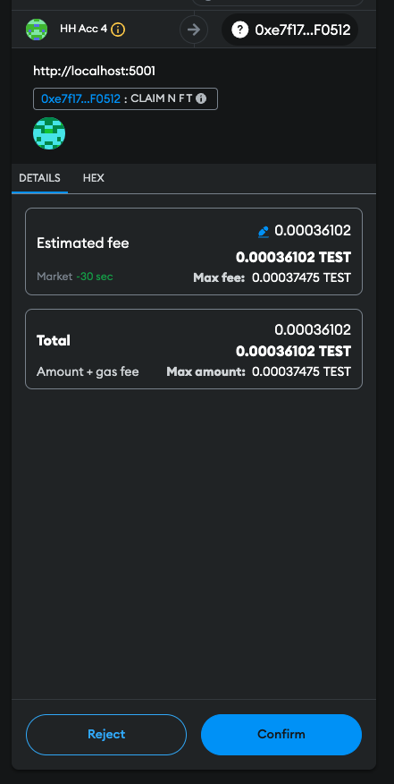

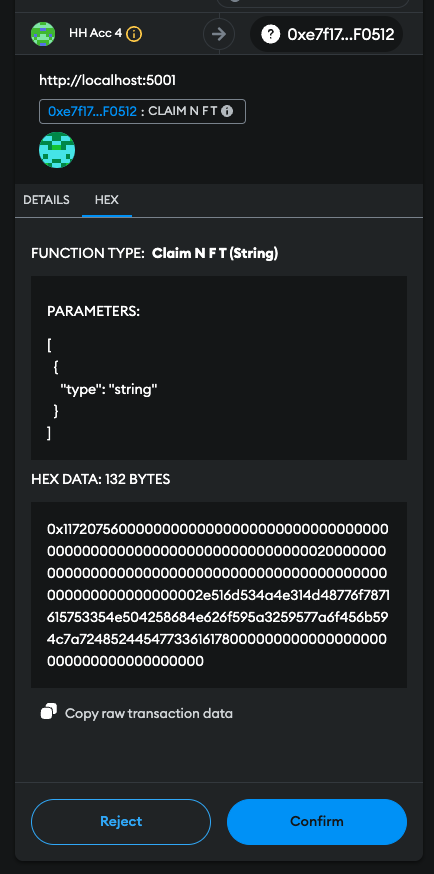

## FAQ PAGE

This page is a classic Frequent Asked Questions page trying to explain why someone would have to donate through the proposed system.

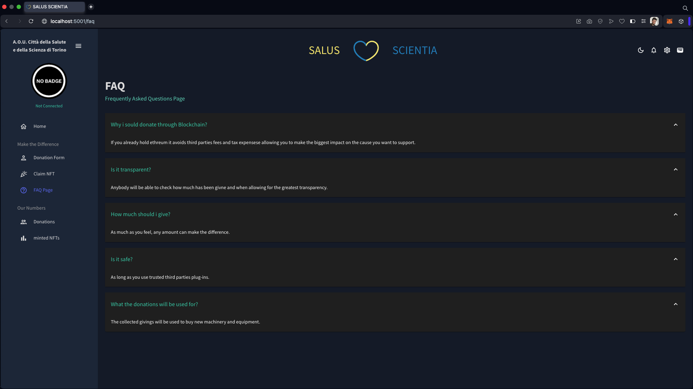

## DONATIONS

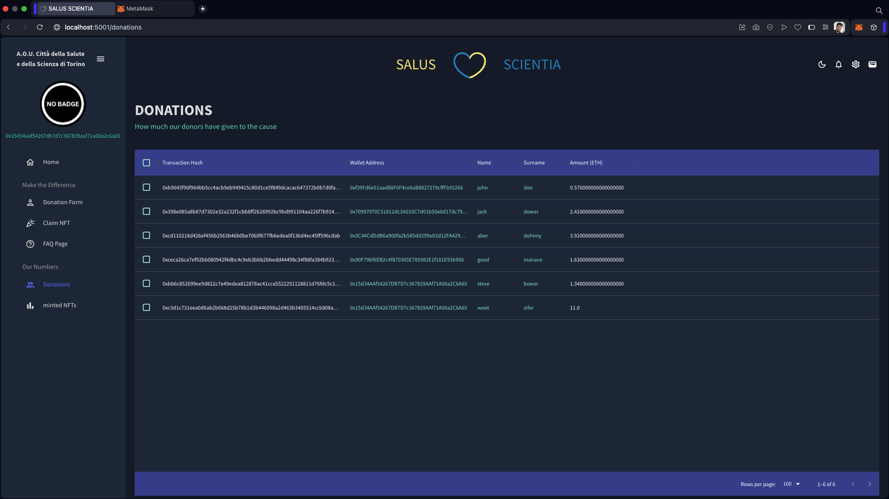

## MINTED NFTs

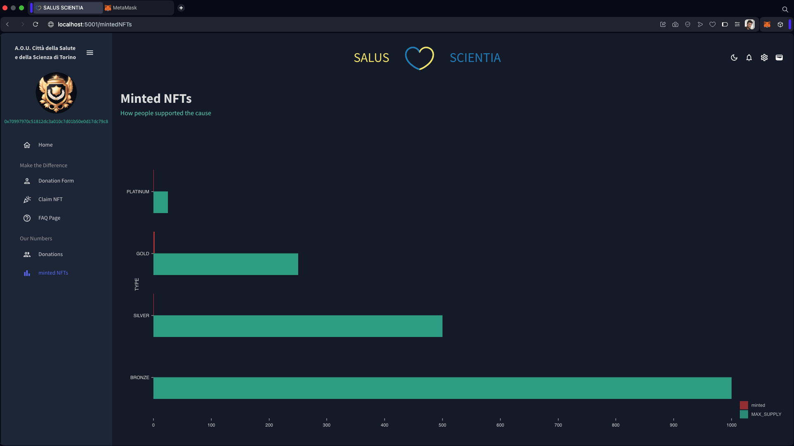

